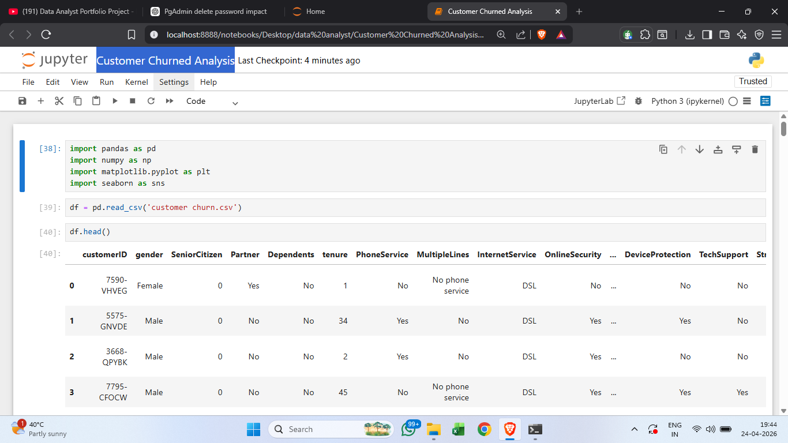
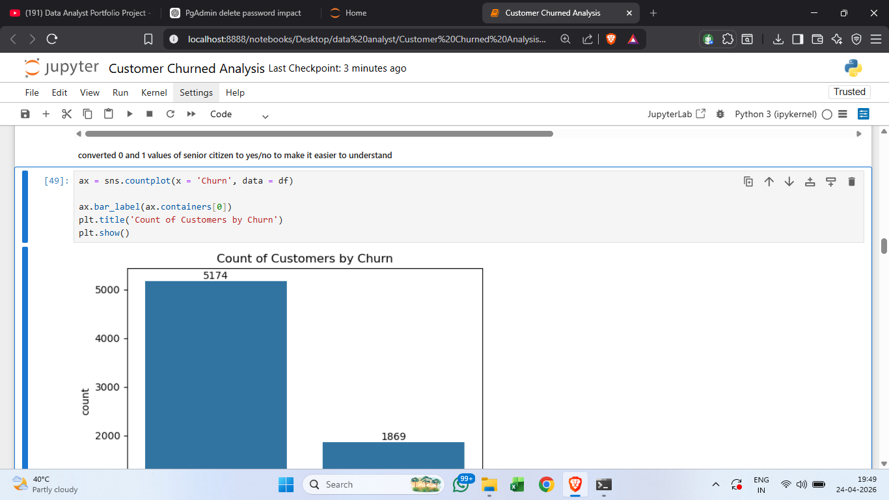
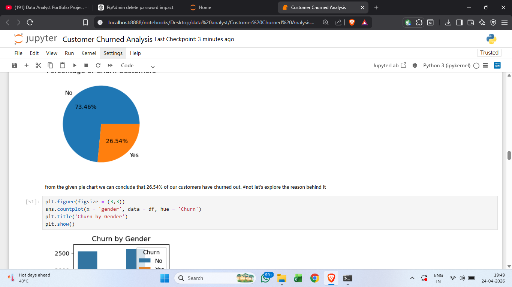
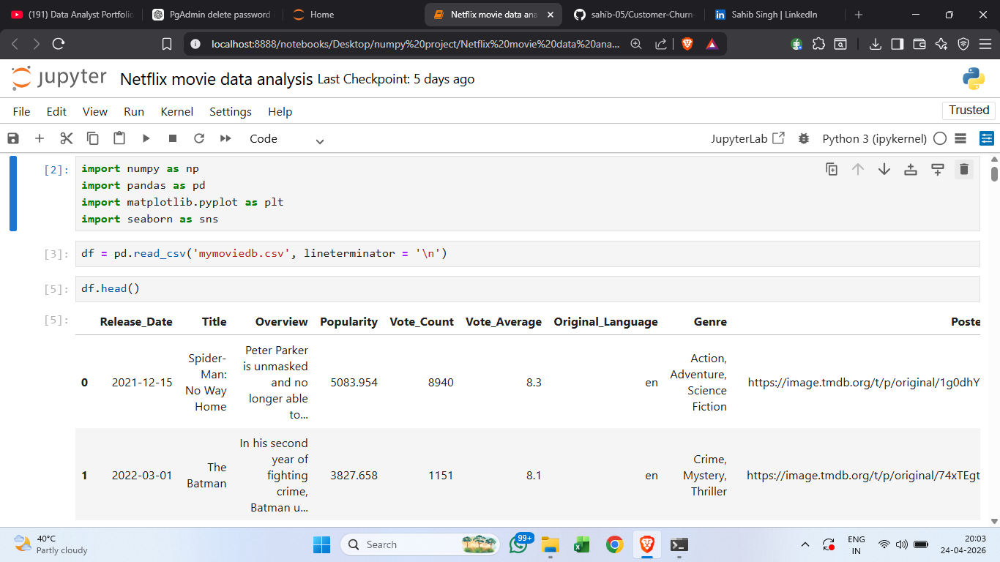
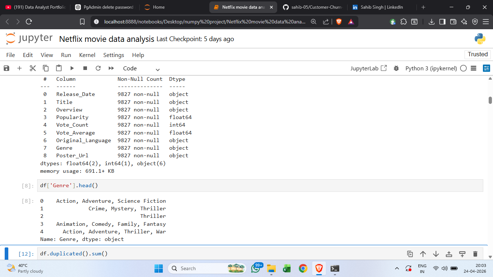
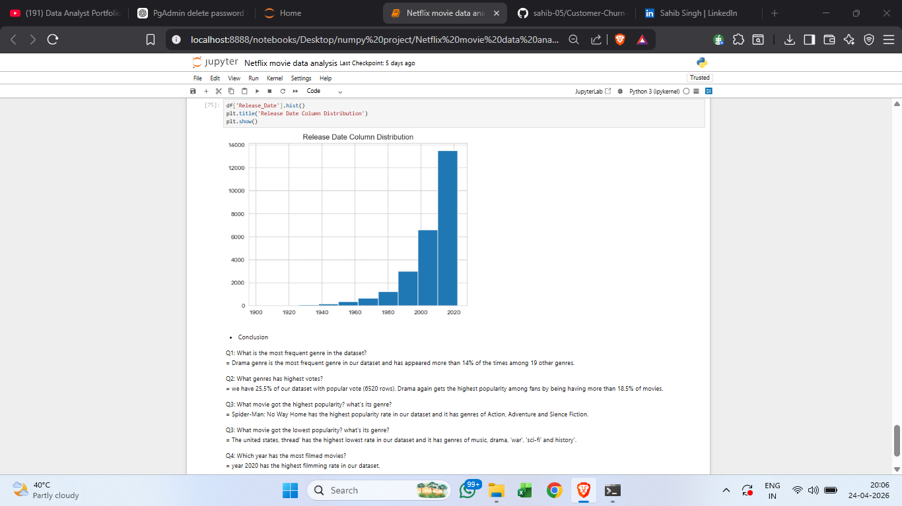
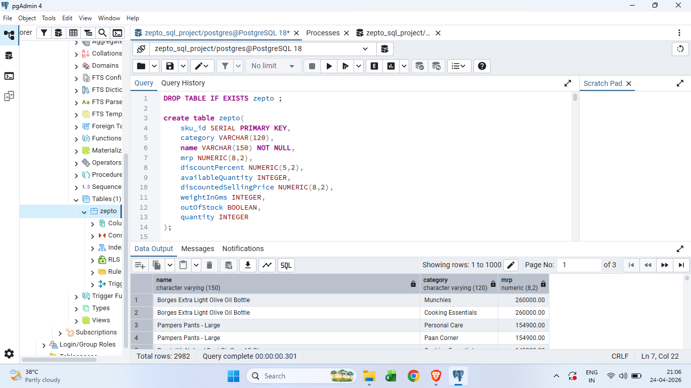
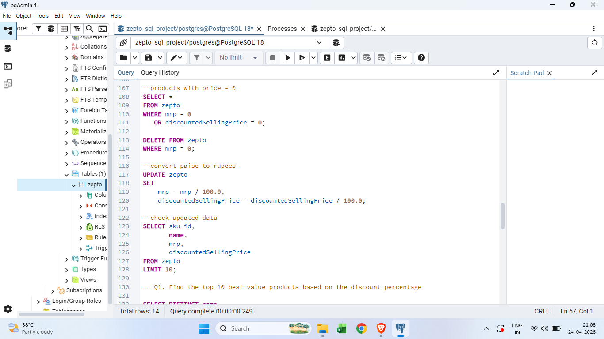
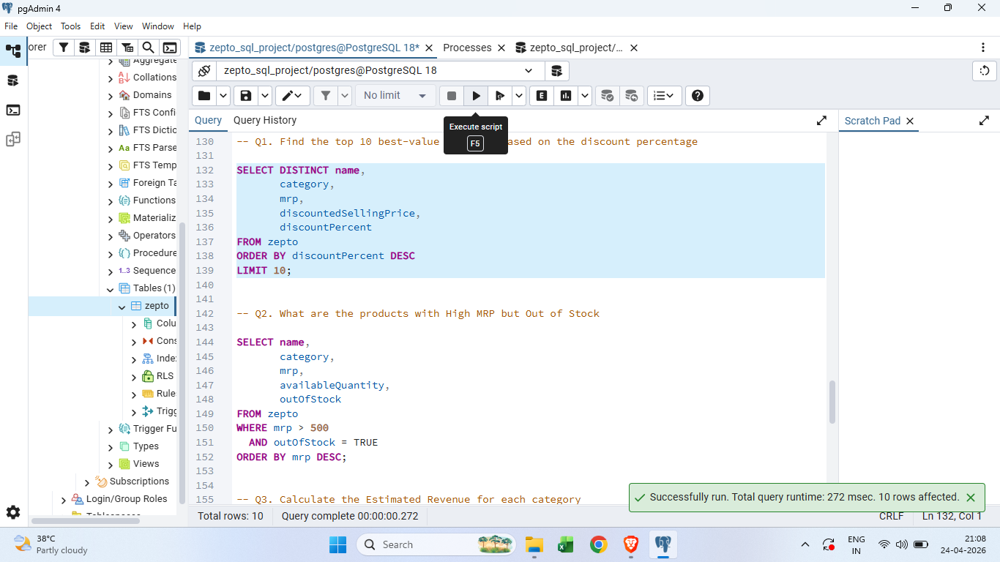
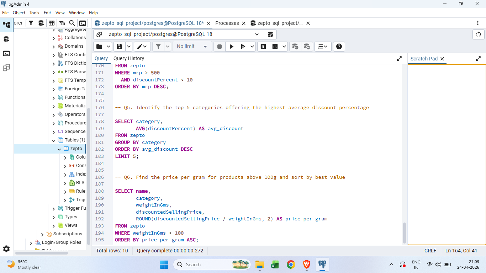

# Sahib Singh

## 👨‍💼 Profile Summary
Aspiring Data Analyst with strong academic exposure to data analysis and visualization.  
Skilled in data cleaning, wrangling, and transformation using Python (Pandas, NumPy) and SQL.  
Experienced in building interactive dashboards using Power BI to communicate insights and support data-driven decisions.

---

## 🛠️ Skills

**Languages**  
- Python  
- SQL  

**Tools & Visualization**  
- Excel  
- Power BI  
- Aws(amazon web services) 
- Google Sheets  
- Jupyter Notebook  

**Databases**  
- MySQL  

---

## 📊 Projects

### 📊 Customer Churn Analysis
- Tool: Python, SQL  
- Analyzed customer churn patterns, customer retention rate, and service usage trends using data-driven insights.

<table>
  <tr>
    <td></td>
    <td></td>
    <td></td>
    <td></td>
  </tr>
</table>

### 🎬 Netflix Movies Analysis
- Tool: Python, SQL  
- Analyzed movie trends, ratings, genres, and content performance using data-driven insights.

<table>
  <tr>
    <td></td>
    <td></td>
    <td></td>
    <td></td>
  </tr>
</table>

### 🔍 Customer Behaviour Analysis (End-to-End)
- Tools: Python, SQL, Power BI  
- Performed data cleaning, transformation, and exploratory data analysis.  
- Built interactive Power BI dashboards to analyze customer purchasing patterns and trends.
<table>
  <tr>
    <td></td>
  </tr>
</table>
📄 **Project Documents**
- [Business Problem Document](https://sahib-05.github.io/sahibsingh.github.io/Business_Problem_Document.pdf)
- [Final Analysis Report](Customer_Shopping_Behavior_Analysis_Report.pdf)

🗄️ **SQL Queries**
- [Customer Behavior SQL Queries](customer_behavior_sql_queries.sql)

### 🛒 Zepto SQL Data Analysis
- Tool: pgAdmin 4, MySQL  
- Analyzed sales performance, customer orders, and product trends using SQL queries and business insights.

<table>
  <tr>
    <td></td>
    <td></td>
    <td></td>
    <td></td>
  </tr>
</table>

### 📈 Madhav Sales Store Dashboard
- Tool: Power BI  
- Created a sales and profit analysis dashboard to track performance across regions and categories.
<table>
  <tr>
    <td></td>
  </tr>
</table>
  
### 🎵 Spotify Data Analysis Dashboard
- Tool: Power BI  
- Analyzed music trends, top artists, and user preferences using interactive visualizations.
<table>
   <tr>
    <td></td>
    <td></td>
    <td></td>
    <td></td>
  </tr>
</table>

### 📊 Company Summary Report
- Tool: Power BI  
- Designed a summary dashboard showcasing KPIs and overall business performance.
<table>
  <tr>
    <td></td>
    <td></td>
    <td></td>
  </tr>
</table>
 
### 📑 Sales & Profit Analysis
- Tool: Excel  
- Analyzed sales and profit data using formulas, pivot tables, and charts.
<table>
  <tr>
    <td></td>
  </tr>
</table>

---

## 🎓 Education

**Bachelor of Computer Applications**  
Year of Completion: _(2026)_
**Economics**(class 12 (commerce))

---

## 📬 Contact
- GitHub: https://github.com/sahib-05
- Phone No.: 9818429891
- E-mail : sahibsingh9968@gmail.com
- Linkedin : www.linkedin.com/in/sahib-singh-data-analyst

---

Thank you for visiting my portfolio!  
Feel free to connect with me for internships, projects, or learning opportunities.
